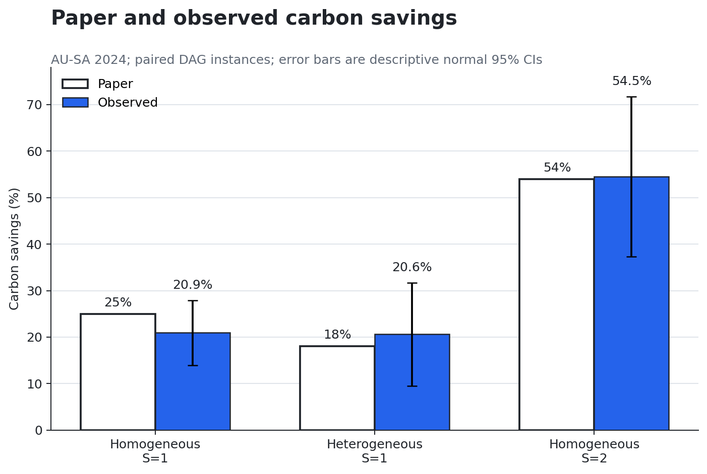
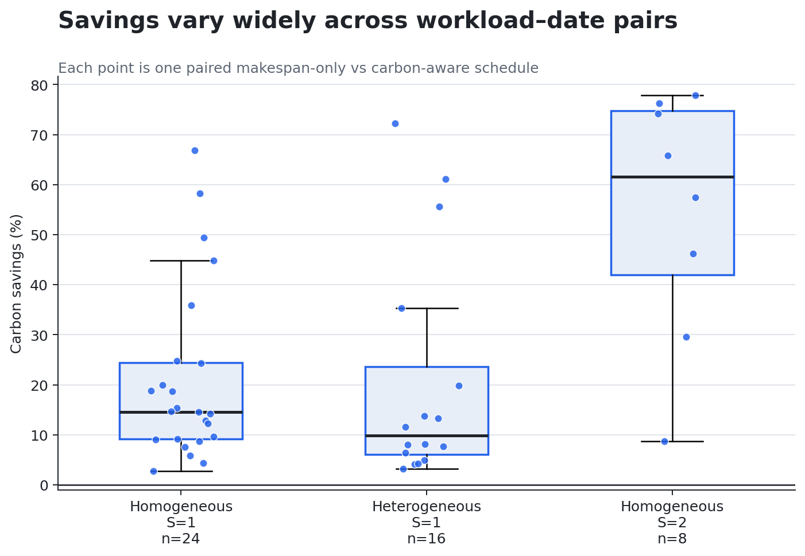
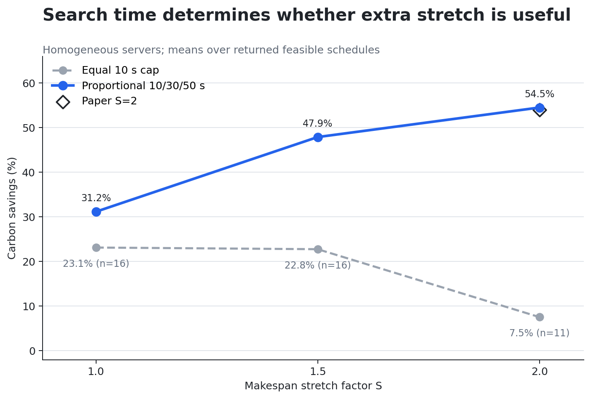
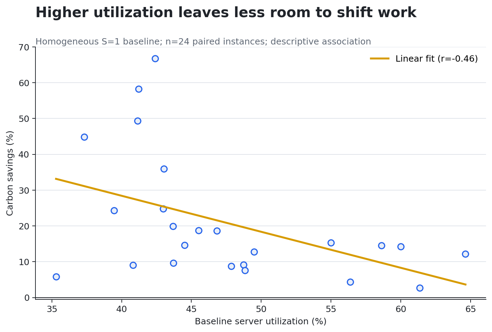

# Reproducing Carbon-Aware Scheduling for DAG Workloads



## The central question and answer

Can a scheduler reduce a dependency-constrained batch workload's operational carbon emissions without delaying its completion? In our downscaled reproduction of Bostandoost et al. ([arXiv:2512.07799](https://www.alphaxiv.org/abs/2512.07799)), the answer was yes.

At the paper's no-slack setting, $S=1$, carbon-aware schedules reduced emissions by **20.93% on homogeneous servers** versus the paper's 25%, and by **20.60% on heterogeneous servers** versus 18%. With proportional solver budgets and $S=2$, homogeneous savings reached **54.52%**, almost exactly the paper's 54%. These are aligned results under a smaller sample and shorter search budget, not a full-scale reproduction.

The most important qualification is computational: simply enlarging the feasible scheduling window without giving CP-SAT more search time produced poor or missing solutions. The paper's 1×/3×/5× timeout policy is consequential to the headline stretch result.

## Claim-by-claim assessment

| Empirical claim | Paper result | Observed result | Assessment | Formal compute |
|---|---:|---:|---|---|
| Carbon savings with no makespan loss, homogeneous $S=1$ | 25.0% | 20.93%, $n=24$, descriptive 95% CI ±6.98 pp | **Aligned**; 4.07 pp lower, with the paper value inside the descriptive interval | 4m27s |
| Carbon savings with no makespan loss, heterogeneous $S=1$ | 18.0% | 20.60%, $n=16$, descriptive 95% CI ±11.10 pp | **Aligned**; 2.60 pp higher | 16m41s sweep, which also tested stretch |
| Homogeneous savings at $S=2$ | 54.0% | 54.52%, $n=8$, descriptive 95% CI ±17.24 pp | **Aligned under proportional timeouts**; 0.52 pp higher | 12m26s |
| Doubling makespan flexibility nearly doubles homogeneous savings | 25% → 54% (2.16×) | 31.16% → 54.52% (1.75×) on the same $n=8$ subset | **Partially aligned**; direction and endpoint align, relative gain is smaller | 12m26s |
| Default homogeneous utilization | 47.15% | 47.45%, $n=24$ | **Aligned**; 0.30 pp higher | Included in 4m27s baseline |
| Heterogeneous carbon–energy trade-off (Fig. 7) | Up to 7% energy gap; at $S=2$, ~50% vs ~30% carbon savings and ~3% vs ~10% energy savings | Not attempted | **Not attempted** | — |
| More servers yield up to 30× higher savings (Table 1a) | 1.13% → 33.98% for $M=2→10$ | Not attempted | **Not attempted** | — |
| More tasks reduce savings by up to 35% (Table 1b) | 30.43% → 19.69% for $k=3→5$ | Not attempted | **Not attempted** | — |
| Carbon-trace region changes achievable savings (Fig. 6) | Qualitative regional differences | Not attempted | **Not attempted** | — |

The three successful evidence runs used **33m34s total wall-clock time** on the user-provided Vast.ai SSH machine (`paper2607-rtx3090`). The workload was CPU-bound constraint programming; the RTX 3090 was not used for acceleration. A monetary cost cannot be recovered from the run evidence. One 9-minute partial sweep crashed after completing its homogeneous half; it is retained only because it led to the heterogeneous-horizon repair.

## The implementation follows the paper's two-level optimization

The implementation uses the authors' released AU-SA 2024 Electricity Maps trace and four-operation DAG pool, pinned to upstream commit [`cc312ef`](https://github.com/rbostandoust/GreenSys26-DAG/commit/cc312ef7d238d56d7114053dcdd04685b8a6a4d7). Each instance contains 10 jobs, four operations per job, five servers, arrivals within 24 hours, and 15-minute epochs.

The consequential path in [`reproduce.py`](../../reproduce.py) is:

1. Sample jobs, DAG parents, arrivals, and a start date deterministically.
2. Build one optional interval per task–machine alternative.
3. Enforce exactly-one machine assignment, DAG precedence, arrivals, and per-machine `NoOverlap`.
4. Minimize makespan and record the optimal $C_{\mathrm{OPT}}$.
5. Rebuild the same instance with `makespan <= ceil(S × C_OPT)` and minimize time-indexed carbon cost.
6. Compare each carbon-aware result with its paired makespan-only schedule.

The carbon objective uses a precomputed start-time lookup rather than the release's per-epoch active Boolean variables:

```python
model.add_element(safe_start, costs, raw_cost)
model.add(active_cost == raw_cost).only_enforce_if(present)
model.add(makespan <= makespan_limit)
model.minimize(sum(task_costs))
```

This is an equivalent discrete objective but produces a smaller CP-SAT model. The heterogeneous powers $[0.25, 0.5, 1, 1.5, 2]$ kW are a constant rescaling of the release's normalized $[1,2,4,6,8]$, so assignments and percentage savings are invariant to that factor.

## Savings exist at the same optimal makespan, but vary widely



All makespan-only baselines in the reported runs were solver-certified `OPTIMAL`. Carbon-aware solves were accepted when CP-SAT returned a feasible schedule inside the required makespan bound. At $S=1$, aware and baseline schedules therefore have the same optimal makespan; on homogeneous servers they also consume identical energy, so savings arise solely by reordering work into lower-carbon epochs.

The distribution is broad. The homogeneous $S=1$ standard deviation was 17.45 percentage points, and individual savings ranged from 2.73% to 66.82%. The spread explains why the 24-instance mean (20.93%) should not be treated as a precise estimate of the paper's 1,000-instance mean.

## Solver time is part of the stretch-factor result



With one 10-second cap at every stretch, homogeneous mean savings fell from 23.13% at $S=1$ to 7.54% at $S=2$, and only 11 of 16 $S=2$ searches returned a feasible schedule. This run did not show the paper's reported stretch effect under equal time limits.

That divergence is diagnostic rather than contradictory: a larger horizon creates a larger search space. On a focused eight-instance child using 10/30/50 seconds for $S=1/1.5/2$—the same 1×/3×/5× policy as the paper—mean savings increased monotonically from 31.16% to 47.90% to 54.52%. Every solve returned a feasible schedule. The paper itself notes that large-$S$ heterogeneous runs can yield negative savings when the timeout prevents a good solution.

## Utilization supports the proposed mechanism



At homogeneous $S=1$, baseline utilization averaged 47.45%, closely matching the paper's 47.15%. Across the 24 paired instances, utilization and carbon savings had a descriptive Pearson correlation of $r=-0.46$: busier schedules tended to leave fewer idle gaps in which tasks could be moved to cleaner epochs.

This is mechanism-consistent evidence, not a causal estimate. Carbon-trace variability, DAG shape, job duration, and the arbitrary carbon footprint of the non-unique makespan-optimal baseline can all affect both the schedule and measured savings.

## What was downscaled or substituted

| Dimension | Paper | This reproduction |
|---|---|---|
| Instances | 1,000 per reported condition | 24 for the main homogeneous $S=1$ result; 16 for the mixed server sweep; 8 for proportional-timeout stretch |
| Carbon solver limits | 60/180/300s at $S=1/1.5/2$ | 10s main/equal-budget checks; 10/30/50s proportional check |
| Trace starts | Described as random points in AU-SA 2024 | Seeded random day offsets in the first 334 days, preserving a 30-day look-ahead |
| Model | OR-Tools CP-SAT with epoch-active variables | OR-Tools CP-SAT with equivalent start-time cost lookup |
| Parallelism | Paper experiments distributed across machines | One SSH host; eight CP-SAT search workers per solve |
| Optimality | Makespan optimum, time-limited carbon search | Same; all baselines optimal, carbon schedules generally feasible rather than proven optimal |

The descriptive confidence intervals use $1.96s/\sqrt{n}$. They summarize observed variation but are not formal population intervals: samples share one seed, the date-selection scheme is finite, and CP-SAT uses multi-threaded search.

## Reproduction and provenance

The fixed command on every formal experiment branch was:

```bash
python3 -m venv .venv && .venv/bin/pip install --quiet -r requirements.txt && .venv/bin/python reproduce.py
```

Reader-facing data are in [`data/`](data/) and the figure builder is [`build_report_assets.py`](build_report_assets.py). The formal lineage is:

- [Headline AU-SA baseline](https://github.com/S-Discipline/30-quantifying-the-carbon-reduction-of-dag-workl/tree/orx/headline-au-sa-reproduction-formal-baseline): 24 homogeneous $S=1$ instances.
- [Stretch and heterogeneity sweep](https://github.com/S-Discipline/30-quantifying-the-carbon-reduction-of-dag-workl/tree/orx/stretch-and-heterogeneity-sweep): 16 instances, two server modes, three stretches, plus the horizon repair.
- [Proportional timeout stretch check](https://github.com/S-Discipline/30-quantifying-the-carbon-reduction-of-dag-workl/tree/orx/proportional-timeout-stretch-check): eight homogeneous instances with 10/30/50-second caps.

## Assessment and what full scale still needs

The main illustrative claim is **aligned**: carbon-aware DAG scheduling reduced emissions at the optimal makespan, and the observed $S=1$ means were close to the paper's 25%/18%. The $S=2$ homogeneous result is also **aligned when solver time scales with search complexity**, landing at 54.52% versus 54%. Equal short timeouts did not show that effect, which makes solver budget a central part of the result rather than infrastructure trivia.

A full-scale reproduction would still need 1,000 instances per condition, the paper's full 60/180/300-second limits, confirmation of the authors' exact date orchestration and CP-SAT parameters, multiple seeds or deterministic single-worker sensitivity, all four regional traces, server/task-count sweeps, and the carbon-versus-energy objective comparison.
